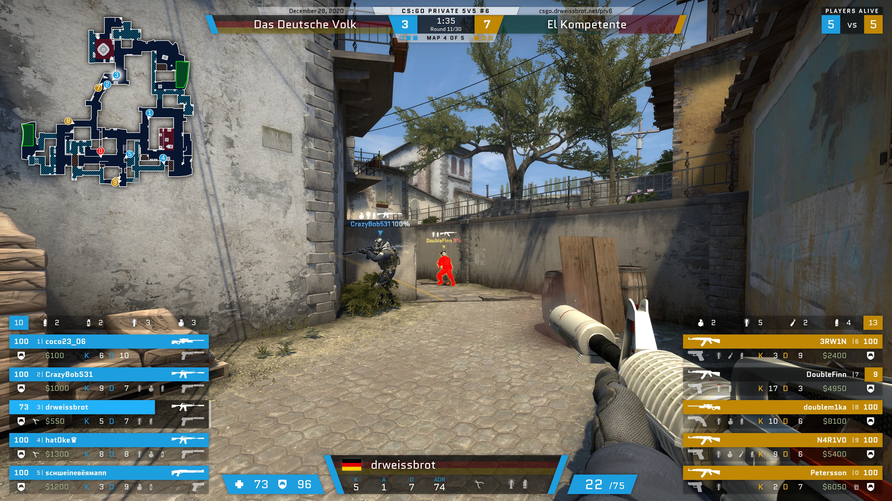

# csgo-hud
This is a custom spectator HUD for Counter-Strike: Global Offensive.

## Installing
No pre-built binaries or installers (yet), so you'll have to do everything yourself.

1. Clone the repository.
1. Install dependencies: `yarn install`.
1. Copy `gamestate_integration_drweissbrot_hud.cfg` into your CS:GO `cfg` directory, normally `C:\Program Files (x86)\Steam\steamapps\common\Counter-Strike Global Offensive\csgo\cfg`.
1. Install the font [Quantico](https://fonts.google.com/specimen/Quantico) on your system.
1. Optional: Copy `spec.cfg` into that same directory – or copy the cvars you want to use into your own config.
1. Run it: `cd` into the directory you cloned this project into, and run `yarn start`. This way, changes you make will be applied immediately.
1. Start CS:GO, and join a match as Spectator, open a GOTV stream, or start playing back a demo. If you can't see the HUD, check [the troubleshooting tips below](#fullscreen-windowed). Also check the [Usage notes](#usage) below for some more guidance.

To create an executable, run `yarn package`. To create an installer, run `yarn build`. You'll find the executable in the `out` directory, in the subdirectory for your architecture.

## Usage
This app uses two separate windows, one is used to configure the HUD, the other is the HUD itself. When you're not spectating a game, it will show small black hook thingies in the corners of your display. Make sure these are where you want the HUD to show up.

Set up the options in the config window to your liking – some of these are a bit weird to understand, so [see below for explanations](#configuration). Note that your changes are not applied immediately, you need to click `Save` on the top right (or `Ctrl+S`) to apply them. Settings are kept across restarts though, except where noted otherwise.

You can also configure some details for your event or series on the `Series` tab, and set the matches of the current series on the `Matches` tab.  
If you want a bigger minimap than the one on the HUD itself while spectating (you may or may not find this useful for observing), switch to the `Minimap` tab before you start recording/streaming, and put the config window on a second display so you can still see it with the game running.

For recording, I use a Display Capture in OBS, with `Capture Cursor` disabled.

## Configuration

Always make sure to save your changes (`Save` on the top right, or press `Ctrl+S`).  
You can switch through the tabs by using `Alt+1` through `Alt+4` while the config window is in focus.

### Preferences tab

#### Sort observer slots
If enabled, the players on the left and right side will be sorted alphabetically. I always find it irritating that players' observer slot (the little numbers, 0 through 9) can change across matches in a series – this prevents that from happening.

Note: If you use this, but don't also enable `Enable AutoHotKey observer slot remapping`, the numbers will only change in the HUD itself. The minimap in the config window will still show the actual numbers you have to press.

#### Enable AutoHotKey observer slot remapping
When used in conjunction with `Sort observer slots` enabled, this will start AutoHotKey and remap your number keys to the sorted player slots. E.g., if a player has slot 4 in-game, but is alphabeticaly at 2, this will remap your 2 key, so that when you press 2, the player will be selected.

AutoHotKey will not always be closed properly, so if you need to close it, check the system tray (right side of your taskbar), right-click AutoHotKey, and quit it there.

This requires that you have AutoHotKey installed and available under `C:\Program Files\AutoHotKey\AutoHotKey.exe`.

Note: This will always be set to off when you start this app; if you want to use it, you need to enable it manually every time.

#### Enable Pre and Post Match Animations
I've built a couple simple intro and outro animations for my specific use case, which include the specific "tournament" name we use, so you'll likely not want to use these. If you think you do want to use them, enable them here – and choose the background video and music files below. These animations will also only work if you set multiple matches on [the `Matches` tab](#matches-tab).

#### Start Post Match Outro and Post Series Outro automatically on match end
If you have enabled Pre and Post Match Animations, this will start the outro animation automatically as soon as the match ends.

#### Pre/Post Match Animations Background Video
If you have enabled Pre and Post Match Animations, select a video file here. It will be used as a background for these animations.

#### Pre Match Intro Music
If you have enabled Pre and Post Match Animations, select an audio file here. It will be used as music for the intro.

#### Post Match Outro Music
If you have enabled Pre and Post Match Animations, select an audio file here. It will be used as music for the outro.

#### Tactical Timeout Music
Select any number of audio files. Whenever a tactical timeout starts, one will be picked at random and start playing immediately. Select no files to disable this. If you want to play a file from this pool manually, hit `F7` any time when the HUD is active; stop playback with `Shift+F7`.

### Series tab

#### Name of Team that should be on the left
Set the name of the team that should always be on the left side. If you leave this empty, the CT side will always be on the left.

#### Series/Event Info
This will be displayed above the team names and scores on the top. I use it to show the name and date of events, and a website URL. Either provide one or three lines; two won't work. Leave empty to disable.

#### Series Number
This is only used for my Pre/Post Match animations. If you're actually using those, this will be displayed in the logo part. If you're not using the animations, just leave it empty.

### Matches tab

If you're casting a series, as in multiple matches with the same teams in row, set it up here to enable some HUD elements that show all matches in the series.

Add as many matches as you need. Set the map name for each using the in-game name, e.g. `de_overpass` or 'cs_italy'. Select if the left or right team (or neither) has picked the map. If the map has already been played, set the score; if you're about to spectate a match, check `Currently Playing` for that match.

## Shortcuts/Hotkeys

* `F5` – Start playing the Pre Match Intro [(only if enabled)](#enable-pre-and-post-match-animations)
* `Shift+F5` – Stop playing the Pre Match Intro
* `F6` – Start playing the Post Match Outro [(only if enabled)](#enable-pre-and-post-match-animations)
* `Shift+F6` – Stop playing the Post Match Outro
* `F7` – Start playing Tactical Timeout music [(only if enabled)](#tactical-timeout-music)
* `Shift+F7` – Stop playing Tactical Timeout music
* `F8` – Recalculate ADR values (may be useful if you're recording a demo and skipped back to an earlier point in the demo; usually shouldn't be needed though)

If the config window is focused, you can use shortcuts to switch through the tabs:
* `Alt+1` – Preferences tab
* `Alt+2` – Series tab
* `Alt+3` – Matches tab
* `Alt+4` – Minimap tab

## Caveats and some Troubleshooting

### Fullscreen Windowed
I've only ever tested this using the "Fullscreen Windowed" (aka "Borderless Fullscreen") option in the video settings, as that is how I usually play the game, but it's likely also the only way to get this HUD to show up.

If you are using Fullscreen Windowed, but still can't see the HUD, try this: Focus the CS:GO game, then press Alt+Tab and select the HUD (not the config window) from that list. Alt+Tab back to CS:GO, and press the Windows key twice. Double-pressing Windows+D may also help.

### Choppy Animations
If the HUD animations aren't running smoothly, the best course of action is probably to limit the FPS of the game itself, e.g. by setting the `fps_max` command in the CS:GO console to a lower value. You'll need to play around with this a bit to find a value that works for your hardware and your settings.  
Reducing GPU load in general can help too, e.g. closing or disabling hardware accelleration in Chrome, Discord, Steam, and any other apps that use your GPU.

If that doesn't help, you could try switching to CPU rendering – this may only make it worse though. If you want to try it, you can do this with the `–disable-gpu` parameter, e.g. run `npx electron-forge start – –disable-gpu` in the project directory.
