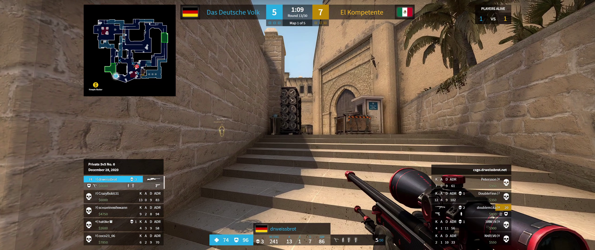

# csgo-hud
This is a custom spectator HUD for Counter-Strike: Global Offensive, heavily inspired (visually) by ESL's custom HUD.

## Installing
No pre-built binaries or installers (yet), so you'll have to build them yourself.

First, clone and install dependencies via Yarn.

Then, you'll need to copy the Game State Integration file into your CS:GO installation's config folder. Under Windows, that should usually be `C:\Program Files (x86)\Steam\steamapps\common\Counter-Strike Global Offensive\csgo\cfg`. Make sure you're in the `cfg` subdirectory, and just copy the `gamestate_integration_drweissbrot_hud.cfg` file there. You may also want to copy the `spec.cfg` file there.

 Finally, back in this project's directory, run either `yarn start` for a development session, or `yarn package` to create an executable, or `yarn build` to create an installer (I personally prefer to use `yarn package`). When that's done, find the executable in the `out` directory (and the subdirectory for your architecture), and run it.

## Usage
You'll only see a window titled `CS:GO HUD Series Data`. You can enter some metadata that should be mostly self-explanatory, and also provide all matches in the series. This will be displayed in the top right corner during freezetimes. Just don't forget to hit the `Save` button at the top of the page once you're done.

Just start CS:GO, and join a server as a spectator (or join a GOTV server), or play a demo. The HUD should automatically appear. You may also want to run `exec spec` in the in-game console, if you've copied it before.

## Caveats and some Troubleshooting
I've only ever tested this using the "Fullscreen Windowed" (aka "Borderless Fullscreen") option in the video settings, as that is how I usually play the game, but it's likely also the only way to get this HUD to show up.

If you are using Fullscreen Windowed, but still can't see the HUD, try alt-tabbing out of CS:GO. Select the HUD if you can see it in the list. From my experience, what works best is to then press Windows+D twice. If you're seeing the taskbar now, double-press the Windows key.
