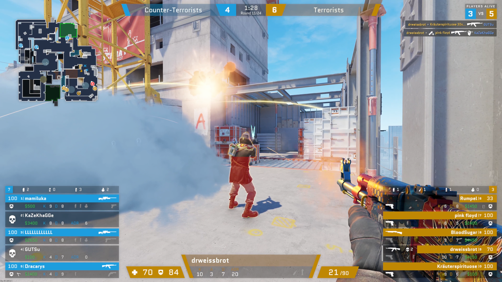
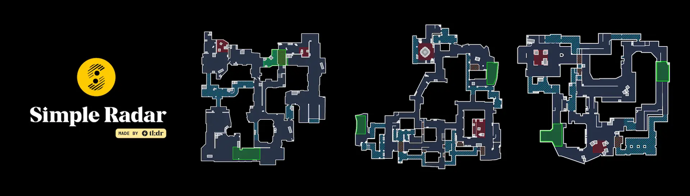

# cs-hud
A Free and Customizable Spectator HUD for Your Counter-Strike 2 (and CS:GO) Streams.

## Getting Started
The easiest way is to use the pre-packaged binaries, but other options will be available in the future.
<!-- TODO write, then link to more in-depth guides for running via yarn, docker -->

1. Download [`cs-hud-win.exe`](https://github.com/drweissbrot/cs-hud/releases/latest/download/cs-hud-win.exe) if you're on Windows, or [`cs-hud-linux`](https://github.com/drweissbrot/cs-hud/releases/latest/download/cs-hud-linux) if you're on Linux. You can find more details on the [Releases tab](https://github.com/drweissbrot/cs-hud/releases/latest).
1. Also download [`gamestate_integration_drweissbrot_hud.cfg`](https://github.com/drweissbrot/cs-hud/releases/latest/download/gamestate_integration_drweissbrot_hud.cfg).
1. Head to your CS2 folder and the `game/csgo/cfg` subdirectory, by default on Windows that is `C:\Program Files (x86)\Steam\steamapps\common\Counter-Strike Global Offensive\game\csgo\cfg`. You can also find it by opening your Steam library, right-clicking CS2, `Properties...`, `Installed Files`, `Browse...`, and then heading into the `game` directory, then into `csgo`, then `cfg`.
1. Save `gamestate_integration_drweissbrot_hud.cfg` there.
1. Start CS2 (restart it if you already had it open), and find a match to spectate. You could for example play a demo, or spectate a friend via CSTV.
1. Now run `cs-hud-win.exe` or `cs-hud-linux`.
1. Open http://localhost:31982/hud in your favorite browser, and you should see the HUD.

There's also the config page available at http://localhost:31982/config, and a separate radar for observing at http://localhost:31982/radar.  
There are also [some console commands you may want to use](docs/cvars.md).

Depending on how you actually want to use the HUD, you've now got two options:

### OBS Browser Source
This is a good choice if you're fine with not seeing the HUD on top of the game yourself, or you can't or don't want to run the game in Fullscreen Windowed.
It'll likely work similarly in alternatives to OBS.

1. In OBS, add a Game Capture or Window Capture, and select Counter-Strike.
1. Add a Browser source. Set the `URL` to `http://localhost:31982/hud?transparent`, the `Width`, `Height`, and `FPS` to the values you want, and make sure that `Custom CSS` is empty.
1. Find a match to spectate in CS, and the Browser source should show the HUD. (The Browser source will not show anything when you're not spectating a match.)

### Fullscreen Windowed
Alternatively, you can use a separate executable to overlay the HUD on top of CS.

1. Download [`cs-hud-win32-x64.zip`](https://github.com/drweissbrot/cs-hud/releases/latest/download/cs-hud-win32-x64.zip) on Windows, or [`cs-hud-linux-x64.tar.gz`](https://github.com/drweissbrot/cs-hud/releases/latest/download/cs-hud-linux-x64.tar.gz) on Linux. Extract all files.
1. Run `cs-hud.exe` on Windows, or `cs-hud` on Linux.
1. Open Counter-Strike, go to the Settings, `Video`, and set the `Display Mode` to `Fullscreen Windowed`.
1. Find a match to spectate in CS. The HUD should now overlay your screen.
1. If the HUD is on the wrong monitor, select it in the taskbar, and press `Win`+`Shift`+Arrow keys to move it to the correct monitor.

## FAQ

### Does this work with CS2?
Yes.  
Everything should work with both CS:GO and CS2. If you spot anything weird, [please open an issue.](https://github.com/drweissbrot/cs-hud/issues)

### Can I use this for my event?
Yes.  
Attribution is not required, but if possible, please include a link to this GitHub project somewhere.
I'd also appreciate if you let me know that you're using it by sending me [a quick email](mailto:cs-hud@drweissbrot.net) (or in whatever way you can get ahold of me).

### Why would I use this?
Counter-Strike's in-game spectator HUD isn't designed for video.
In a stream you can't, for example, just press Tab when you want to know how many kills someone has.
Since CS2 it doesn't even show player names!  
Custom HUDs like this one are designed for video: They show you everything, are more readable on a big TV, and just look a bit nicer than the game.

Why would you use this HUD specificially? It's pretty easy to use, easy to extend and customize to your needs, and free.
(Please do note that this is a passion project, so if you're a big TO that needs support SLAs, you might want to look elsewhere :D)

### How do I change the colors/font/X?
For simple visual changes like colors and fonts, open the HUD config page at http://localhost:31982/config and scroll down to `Style Overrides`:

To change a color, select the color you want to use, then press `Save` and `Force HUD Refresh`.
Most surfaces use the `css.terrorists-fill-rgb` color (and it's CT counterpart), most text uses `css.terrorists-text-rgb`, etc.
Note that color changes are only applied after refreshing the HUD.

To change the font, type in the name of the font you want to use in the `css.primary-font-family` textbox, then press `Save` and `Force HUD Refresh`.
The font needs to be installed on your PC.
Note that font changes are only applied after refreshing the HUD.

If you want everything to be a bit more zoomed in or zoomed out, type something into the `css.base-scale-factor` textbox, then press `Save` and `Force HUD Refresh`.
By default this is roughly equivalent to `10px`, so if you want things to be twice as big, type in `20px`.
Things will likely break if you go too small or too big.
Note that changes to the scale factor are only applied after refreshing the HUD.

If you want to change something else, [have a look at the docs](docs/theming.md).

### I need help!
Please [have a look at the docs folder](https://github.com/drweissbrot/cs-hud/tree/master/docs) first.
If nothing in there helps you, [please open an issue.](https://github.com/drweissbrot/cs-hud/issues)

## Credits
Special Thanks to [readtldr.gg](https://readtldr.gg) for providing [Simple Radar](https://readtldr.gg/simpleradar), the clean and readable minimaps included in this project.
([You can also use them in the game, they're pretty great!](https://readtldr.gg/simpleradar))

Big shoutout to [u/Bkid](https://www.reddit.com/user/bkid) for [documenting most of Game State Integration](https://www.reddit.com/r/GlobalOffensive/comments/cjhcpy/game_state_integration_a_very_large_and_indepth).
This project wouldn't have happened without that post.
